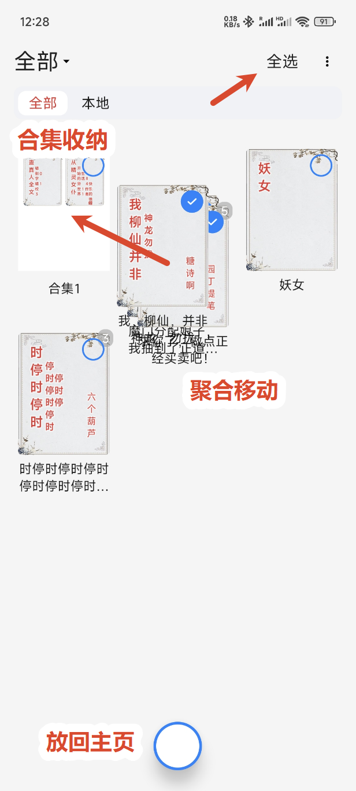

<div align="center">
<b>阅读SK · legado-sk</b>
<br>
个人自用版阅读器：结合多个 legado 分支的优点，精简、同步增强、听书优化。
<br><br>



</div>

---

## 项目定位

**legado-sk（阅读SK）** 是个人自用改造的阅读器版本，在开源阅读生态（[Legado](https://github.com/gedoor/legado) 系）的基础上，结合多个分支的优点整合而来：

- 对 [阅读 Archive](https://github.com/Rimchars/legado) 风格的**功能进行简化**，只保留日常阅读与听书最核心的能力，轻量自用；
- **融入 [legado-E](https://github.com/Luoyacheng/legado-E) 的「阅读进度同步增强」**，跨设备进度同步更可靠；
- **优化听书界面与听书体验**，听书是日常使用的高频场景。

整体用于自用，代码在 [legadoC（阅读 C）](https://github.com/CCSSNE/legadoC) 基础上改造而来（legadoC 继承自阅读 R 分支）。

## 特色功能

### 📖 阅读进度同步增强（源自 legado-E）

- **纯位置比较**：云端与本地进度按「章节 + 章节内位置」比较，不再受时间戳干扰（时间戳在打开/翻页/退出时都会被刷新，导致"本地永远比云端新"而拉不下云端进度）；
- **弹窗确认**：检测到云端位置比本地靠后时，弹出提示询问是否跳到最新位置，避免静默覆盖进度；
- **自动同步**：打开书自动拉取、网络恢复自动同步、**息屏/退出书籍界面自动上传**、翻页 5 分钟定时上传；
- **防误同步**：章节跳转（目录/全文搜索）不触发同步；web 端阅读进度互不覆盖；
- **WebDAV 双向同步**：书架全量拉取 + 单本实时同步，修复了全量拉取中途退出的问题；
- 文本与漫画端均支持，开关：「设置 → 备份 → WebDAV → 同步增强」（默认开启）。

### 🎧 听书体验优化（源自 legadoC / 阅读 R 分支）

- 听书与阅读进度联动，从选中文本/段落继续朗读；
- 双击段落从该段落开始朗读，文本选择菜单「朗读」从选中段开始；
- 听书续读不跳章、进度不丢失；
- 通知弹窗不反复打扰。

### ✂️ 简化（相对阅读 Archive）

- 不引入大型 AI、世界书、多角色朗读、BGM、云中继、Compose 大重构等重功能，保持轻量与稳定；
- 聚焦：书源阅读、书架管理、听书、WebDAV 备份与进度同步。

## 下载与构建

- 构建要求：JDK 17、Android SDK 36（platforms;android-36 + build-tools;36.0.0）、Gradle 8.14.4；
- 构建命令（arm64-v8a 单 ABI）：
  ```bash
  gradle :app:assembleAppC -Pabi=arm64-v8a
  ```
- 产物：`app/build/outputs/apk/app/c/legado_app_*.apk`
- 包名 `io.legado.app.sk`（与原版/阅读R/阅读C 均共存），应用名「阅读SK」。

## 来源与致谢

- 代码基础：[legadoC（阅读 C）](https://github.com/CCSSNE/legadoC) — 继承自 [阅读 R](https://github.com/gedoor/legado) 分支，主打听书体验优化；
- 进度同步增强：[legado-E（阅读 Sigma）](https://github.com/Luoyacheng/legado-E)；
- 简化思路参考：[阅读 Archive](https://github.com/Rimchars/legado)；
- 上游：[Legado（阅读）](https://github.com/gedoor/legado)。

## License

[GPL-3.0](LICENSE) — 遵循 legado 开源生态的许可协议。
